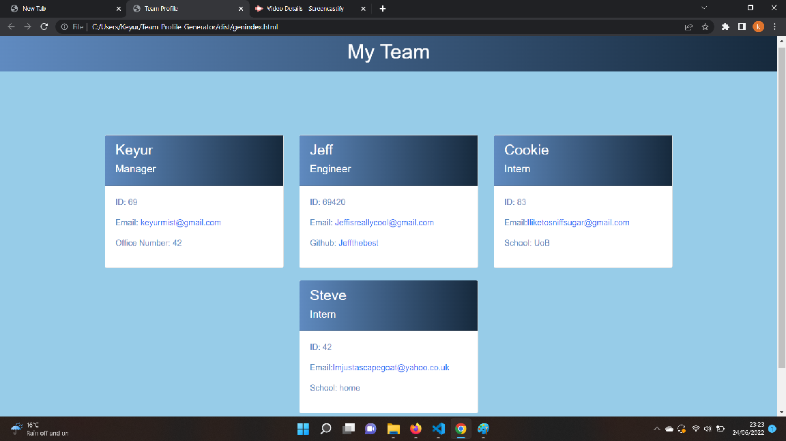

# Team-Profile-Generator

## Table of Contents

- [Description](#description)
- [Installation](#installation)
- [Initialisaton](#initialisation)
- [Media](#media)
- [License](#license)
- [Contributing](#contributing)
- [Tests](#tests)
- [Questions](#questions)

## Description

This project was designed for a user to be able to use inquirer in node to create a fully functioning team profile when prompted with a list of questions. Languages usedd include CSS, JS, HTML. Packages used include Jest and Inquirer. Everything is done using node.

## Installation

Please follow the instructions on how to install the application:

```
npm init -y
npm i inquirer
npm i jest
```

## Initialisation

Please follow the instructions below to run the application:

```
npm run test
node index.js
```

## Media

Below shows a screenshot of the generated team profile:


You can watch the walkthrough video 

## License

This Project is licensed under MIT 

## Contributing

Ways to contribute to the project include:

none

## Tests

Follow the instructions below:

none

## Questions

You can e-mail me at: keyurmist@gmail.com

Visit my GitHub 
